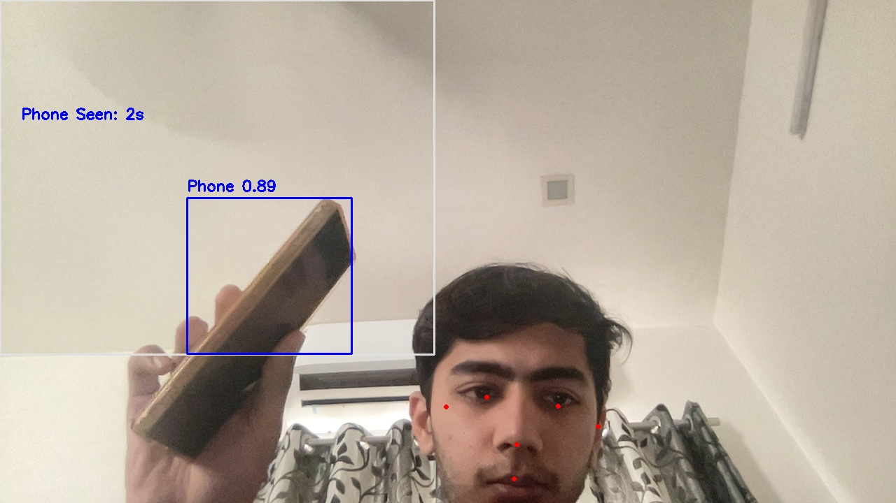
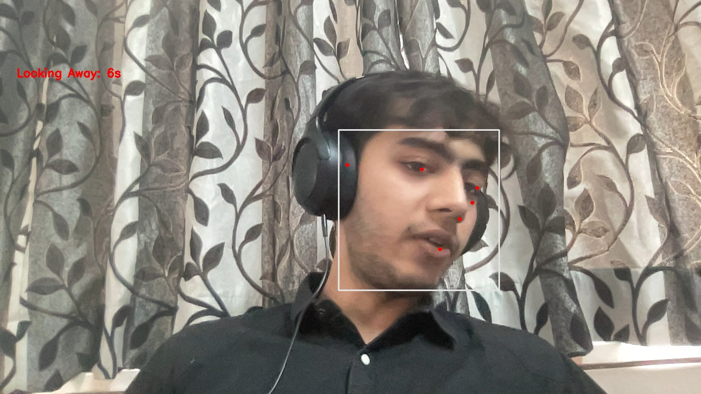
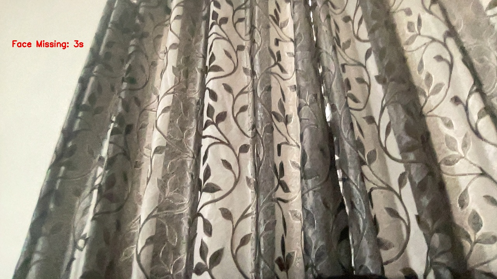
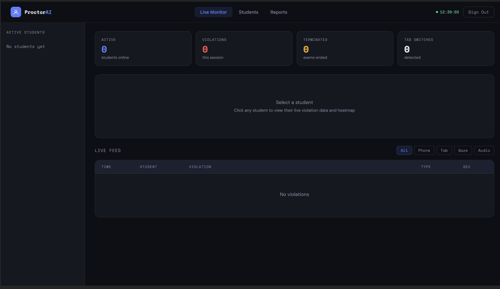
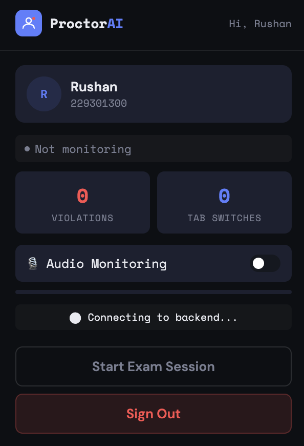

# 🎓 AI-Based Exam Proctoring System

A multi-modal AI proctoring pipeline for online exams — combining computer vision,
temporal pattern detection, and browser-level monitoring to flag cheating behavior
in real time, without requiring a human invigilator.

Built as a major project (B.Tech CSE, Manipal University Jaipur) under the guidance
of Dr. Tapan Kumar Dey. 📄 [Full project report](docs/RushanHala_ProctorAI_Major_Project_Report.pdf)

---

## 📸 Screenshots

**Detection in action**

| Prohibited object detection | Gaze diversion | Face missing |
|:---:|:---:|:---:|
|  |  |  |

**Teacher dashboard & student app**

| Live monitoring dashboard | Student-side session view |
|:---:|:---:|
|  |  |

---

## 🧠 What it does

The system detects **six types of violations**, each logged with a timestamp,
a JPEG screenshot uploaded to Cloudinary, and a structured record written to
Firestore in real time. An exam session auto-terminates after 6 cumulative
violations.

- **Prolonged phone use** — custom-trained YOLOv8n model, phones held or in frame >2s
- **Face missing** — student absent from the camera frame for >3s
- **Multiple faces** — a second person detected in the exam frame
- **Sustained gaze deviation** — MediaPipe FaceMesh tracks head pose/gaze beyond a set threshold
- **Ambient audio** — flags speech/whispering above a configurable RMS threshold
- **Browser-level monitoring** — Chrome extension flags tab switching and unfocused windows

**Teacher dashboard** (deployed on Netlify) shows live per-student violation
timelines, heatmap visualizations of violation patterns over the exam
duration, screenshot evidence viewing, and **post-exam PDF report
generation** — exportable for submission to an academic integrity committee.

The sample exam platform itself is a single-page app with Firebase
authentication, a proctor-verification gate (checks the extension is active
before granting exam access), and a 20-question assessment module used for
testing.

---

## 🗂️ Project Structure

```
ai-proctor/
├── proctor_main.py         ← Main proctoring loop (webcam + detection)
├── proctor_stage1.py        ← Stage 1 detection (face/gaze/object)
├── proctor_stage2.py        ← Stage 2 detection (extended face mesh + object logic)
├── server.py                ← WebSocket server (violation events, Firestore, Cloudinary)
├── best.pt                  ← Trained YOLOv8 weights (prohibited object detection)
├── yolov8n.pt                ← Base YOLOv8 nano weights
├── requirements.txt
├── .env.example              ← Template for required secrets (copy to .env)
├── extension/                ← Chrome extension (student-side monitoring)
│   ├── manifest.json
│   ├── background.js
│   ├── content.js
│   ├── popup.html / popup.js
│   └── firebase-config.js
└── dashboard/                 ← Teacher dashboard (deploy to Netlify)
    ├── index.html
    ├── login.html
    ├── report.html
    ├── config.js
    └── firestore.rules
```

---

## ⚙️ Setup

### 1. Clone & install dependencies
```bash
git clone <your-repo-url>
cd ai-proctor
pip install -r requirements.txt
```

### 2. Configure secrets
Copy `.env.example` to `.env` and fill in your own values, then export them
(or use a tool like `python-dotenv` / your shell profile):

```bash
export CLOUDINARY_CLOUD_NAME=your_cloud_name
export CLOUDINARY_API_KEY=your_api_key
export CLOUDINARY_API_SECRET=your_api_secret
```

### 3. Add your Firebase service account key
Download your own key from **Firebase Console → Project Settings → Service
Accounts → Generate New Private Key**, save it as `serviceAccountKey.json` in
the project root. It's already in `.gitignore` so it won't be committed.

### 4. Run the WebSocket server
```bash
python server.py
```

### 5. Run the proctoring pipeline
```bash
python proctor_main.py
```

### 6. Load the Chrome extension
Go to `chrome://extensions`, enable Developer Mode, click **Load unpacked**,
and select the `extension/` folder.

### 7. Deploy the dashboard (optional)
The `dashboard/` folder is a static site ready to deploy on Netlify — connect
your Firebase project via `config.js`.

---

## 🛠️ Tech Stack

| Component | Tool |
|-----------|------|
| Face/gaze tracking | MediaPipe FaceMesh |
| Object detection | YOLOv8 (Ultralytics) |
| Temporal thresholds | Time-based filters (e.g. phone visible >2s, face missing >3s) to reduce false positives |
| Cloud backend | Python `websockets` + Firebase Admin SDK |
| Realtime events | WebSockets |
| Screenshot storage | Cloudinary |
| Violation logs / student state | Firebase Firestore |
| Browser monitoring | Chrome Extension (Manifest V3) |
| Teacher dashboard | Static site on Netlify |

---

## 🔒 Security Note

This repo does **not** include any live credentials. `serviceAccountKey.json`,
`.env`, and Cloudinary secrets are all gitignored — you'll need to provision
your own Firebase project and Cloudinary account to run this end-to-end.
The Firebase **web** API key in `extension/firebase-config.js` is safe to keep
public (it identifies the project, not a secret credential) as long as your
Firestore security rules are properly locked down — see `dashboard/firestore.rules`.

---

## 📊 Detection Accuracy & Latency

Measured during testing, documented in the full project report:

| Violation Type | Detection Rate | False Positive Rate | Notes |
|---|---|---|---|
| Phone detected | ~91% | ~4% | Misses phones lying face-down; 2s filter removes most reflection false-positives |
| Left seat / face missing | ~98% | <1% | 3s threshold avoids triggering on brief lean-forwards |
| Multiple faces | ~94% | ~3% | Side-profile faces occasionally missed; posters can trigger false positives |
| Looking away | ~86% | ~8% | Natural head sway near the threshold causes occasional false positives |
| Audio detected | ~88% | ~6% | Sensitive to room noise floor; threshold is configurable |
| Tab switch | ~100% | 0% | Digital event, deterministic |
| Window unfocused | ~100% | <1% | Occasionally triggers on OS popup dialogs |

**End-to-end latency** (violation occurring → appearing on teacher dashboard): **~1–3 seconds total**, broken down as:

| Stage | Typical Latency |
|---|---|
| Frame capture → detection | 30–100 ms (YOLO inference) |
| Detection → WebSocket send | <5 ms |
| WebSocket → server | 10–50 ms |
| Cloudinary screenshot upload | 200–800 ms (main bottleneck) |
| Firestore write → dashboard | 500–1500 ms |

Automated exam termination (6 cumulative violations) executes immediately
server-side and reaches the client within one WebSocket round trip (<100ms) —
independent of the dashboard-display latency above.

## 📅 Status

Core detection pipeline, WebSocket server, Chrome extension, and teacher
dashboard are functional and tested end-to-end. Main limitation is phone
detection on face-down phones and gaze detection at extreme camera
distances — see the full project report for a detailed breakdown.

---

## 👤 Author
Rushan Hala — B.Tech CSE (AI Minor), Manipal University Jaipur
